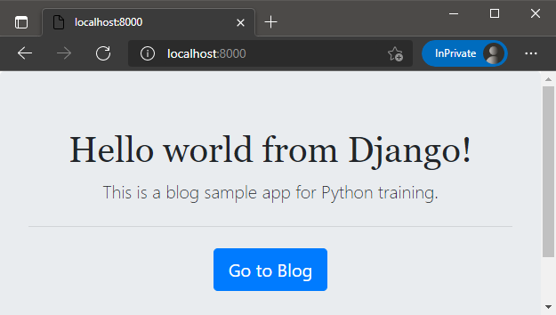
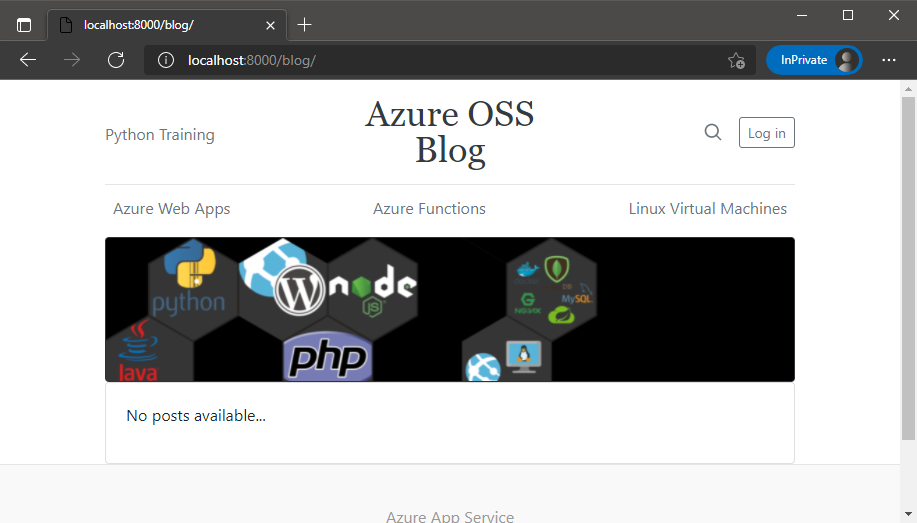
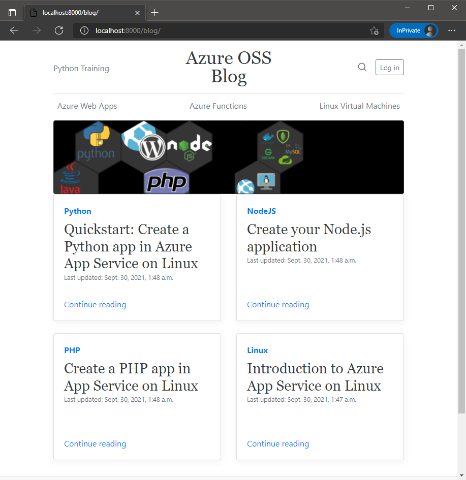
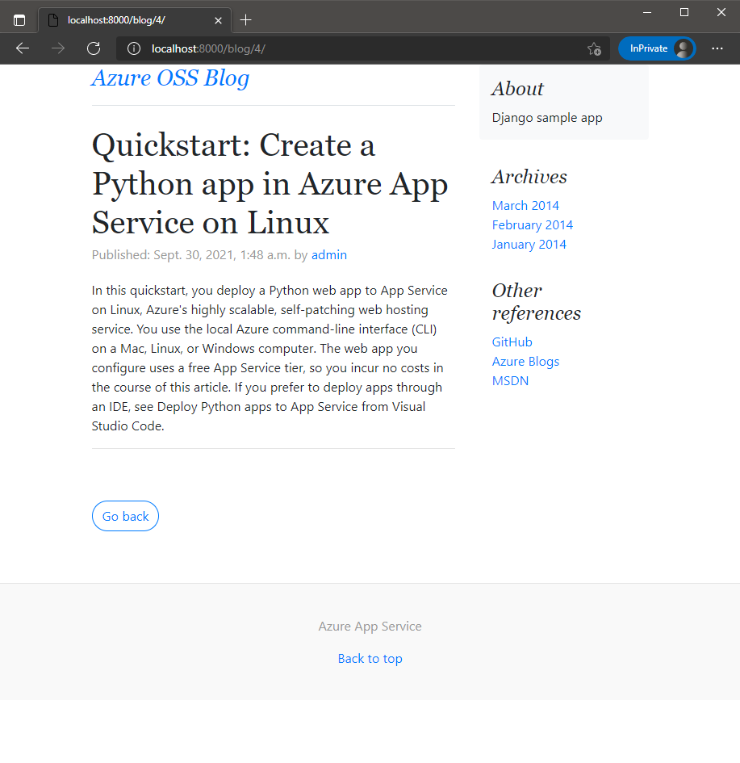

# How to run this app 
1. Clone this repository `https://github.com/azureossd/python-deployment-samples.git` and cd into **python-deployment-samples/django/django-blog** folder.
2. Create a **virtual environment** with any python version >=3.
    - If you are using Windows:
        ```shell
        python -m venv env
        ```
    - If you are using Linux:
        ```shell
        python3 -m venv env
       ```
3. Activate the virtual environment.
    - If you are using Windows in cmd:
        ```shell
        env\Scripts\activate
        ```
    - If you are using Linux
        ```shell
        source env/bin/activate
        ```
4. Once the virtual environment is activated, install this specific Django version:
    ```shell
    pip install Django==3.0.4 whitenoise==5.1.0
    ```
5. You will need to create a database for the application, for this module we are going to use SQLite. Since you have a model called **Post** under **`blog/models.py`** you can run the following command to create migrations for this model.
    ```shell
    python manage.py makemigrations blog
    ```
   >**Note**: You might notice that running the makemigrations command also created the file db.sqlite3, which contains your SQLite database. If you use any other database backend like PostgreSQL or MySQL, you must create the database yourself before running makemigrations.
6. Create all tables in the new database for admin, auth, your models, sessions, etc with:
    ```shell
    python manage.py migrate
    ```
7. One of the most important features in Django is the built-in admin interface by default. You can create users and groups and manage your models. Let's create a superuser (admin) to manage this login with the following command:

    ```shell
    python manage.py createsuperuser
    ```
    >**Note**: Set a username and password (just remember the password for future steps) 
8. To run the Django application, you can use the runserver command to start the development server on the internal IP at port 8000, try the following command:
    ```shell
    python manage.py runserver
    ```

     Django app will be listening by default in port 8000, so browse to http://localhost:8000/ to get the default page. To change this port, you can use `python manage.py runserver 0:8080`
9. Click on `Go to Blog` blue button:

   
   

# Django Admin Portal
1. To interact with Django Admin portal, click on **Log in**, this button will redirect to **`/admin`**, this portal is automatically created by Django as mentioned before, you can also request directly to `http://localhost:8000/admin/`.
2. Log in into the admin portal with the superuser created before.
3. Click on **Blog** and add several Posts clicking on **ADD POST**. 

   You can use the posts template located `blog\static\posts.txt` or create some posts by yourself.

   The `Post Model` contains:
    - Title
    - Content
    - Tag
    - Author
    - Date Published
4. After adding some posts, browse the site `http://localhost:8000/blog/` to see the changes.

   

5. You can click in each post and it will redirect you to the content, the template is  using syntax `http://localhost:8000/blog/<index>/`

   


